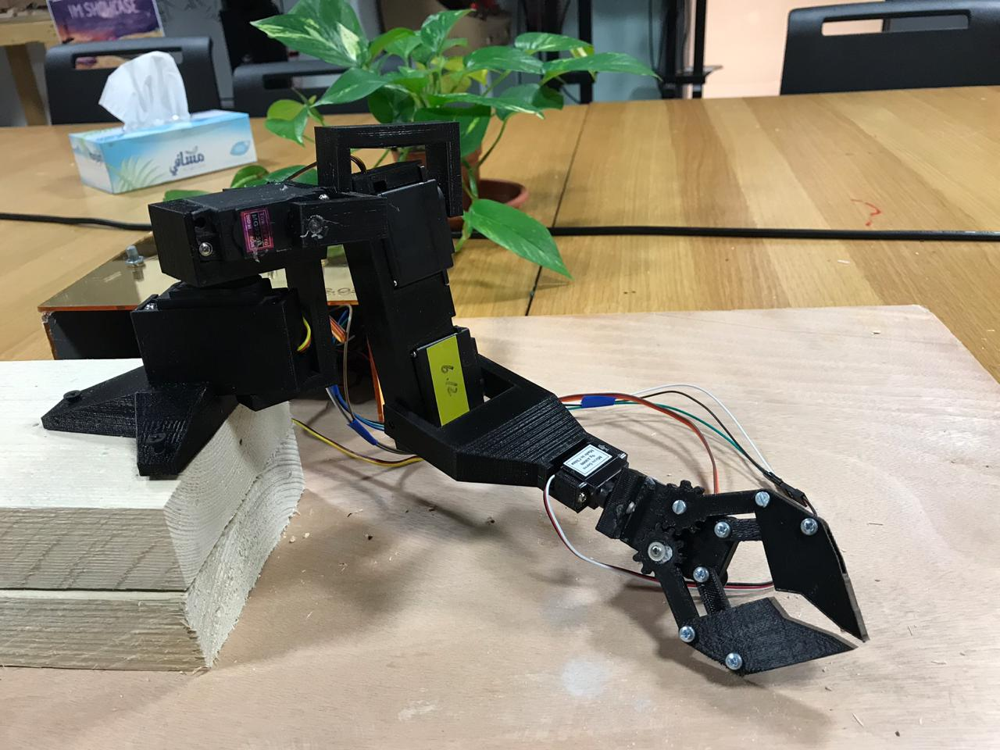

# MachineLab Final Project

My plan for the final project was a to a robot arm. It was actually something I wanted to do since the start of the class and I wasn't sure if had the skills for it but i decided Id do it anyways and learn on my way what I didnt learn yet to make it possible. 

I wanted to 3D print the main body of the arm because I wanted to get more familiar with the software and using the printer. At the beginning of the class I was very intimidated of even asking about the laser cutter, but as the class went on and I got accustomed to it and even learned how to use it myself at the Advanced Manufacturing Workshop. I've learned how to use a lot of tools for the class projects but the one thing I still wasnt familiar with was the 3D printer. I was very interested in 3D modelling and I figured that if I ever wanted to learn it, the best way would be to use it for a project. 

I searched the internet for tutorials on making a robot arm, this was my first time following a tutorial because all my past projects for the class I thought up myself with no external references. I found one project that I liked with a video tutorial that I decided to modify for my needs. The 3D modelling was time consuming because it took me more time than I expected to (kind of) learn SolidWorks. The tutorail included models but I had to chnage them to fit with the servos we had because ours were slighly different in terms of dimensions and had wires coming out of a different spot. 

My project overall was a 3D printed robot arm with potentiometers attached to a lazer cut control panel used to control 6 servo motors


I enjoyed doing it and I am glad that I 3D printed it becauase that made me lean the skills I also wanted to learn which means that I learnt a great combination of electronics, woodwork, modeling and laser cutting (making the sketches for it) from the class. 

Since the modeling and 3D printing everything took a lot of time, I only had less than a week to put everything together.

The electronics part was challenging for me since I had to figure out how to connect all the servo motors together and soldering so many things is still challenging to me to have them soldered close to the board. I in the beginning of the class, I accidnetally burnt my arduino when I got the connections wrong and that made me kind of anxious to do that again, but thankfully Michael was being really helpful. 

The code part was easy, but I generally am bad at coding so it always takes more effort and stress for me than it should. But I did it. 

A problem I had was that the arm was heavy and so it would unscrew the screws of the motors after it moved for a while, I solved that problem by using superglue to glue the screws in. I also had to take a mini servo from the EDS becasue the IM lab ran out. 

I had some trouble with the potentiometers on Wednesday night, and I marked the one that acted funny with blue tape, but then it all seemed to work fine. Then when I went to set up before the show, I realised that my arduino was shutting down and I panicked because there wasnt any time. Luckily, Michael was nice enough to sit down with me and trouble shoot it and we found out that the pin with the marked potentiometer was for some reason connected to another pin.... We didnt know why but we cut off the pin and it was all fine. 

The week of the Showcase was very stressful for me and I struggled a lot with my anxiety and I was even more anxious about presenting my project. I connected everything but it didnt work and i panicked and thought that something was wrong with the code. So my friend and I with Michael's help started troubleshooting the code during the showcase. Everything seemed to be correct but the arm just did not move and I was about to give up. I then realised that becasue I was so nervous, I did not properly plug in the power supply and that was the issue. I was extremely happy that my project worked for the last half of the IM showcase. I could have handled it much better and had my project work from the start if i was calm about it, but I was very nervous about it technically being an "exhebition". But its a learning experience. 


List of important parts:

1. 4 servos
2. 2 mini servos
3. arduino uno 
4. motor shield
5. 6 potentiometers
6. power supply
7. USB cable 


# Pictures




# Models 

All the 3D models are here https://github.com/leodunadan/MachineLab/tree/master/FinalProject/Models
3D models were obtained from https://www.electromaker.io/project/view/robot-arm


# Video tutorial 

This was the video that I based my project on  https://www.youtube.com/watch?v=KKuJuLZTK2M


# The code

```

#include <Servo.h>


Servo Servo1;  // create servo object to control a servo
Servo Servo2;
Servo Servo3;
Servo Servo4;
Servo Servo5;
Servo Servo6;

const int ServoP1 = 2;  //Attach the pins. P stands for Pin 
const int ServoP2 = 3;
const int ServoP3 = 4;
const int ServoP4 = 5;
const int ServoP5 = 6;
const int ServoP6 = 8;

const int potpin0 = 0;  // analog pin used to connect the potentiometer
int val0;    // variable to read the value from the analog pin
 
const int potpin1 = 1;  // analog pin used to connect the potentiometer
int val1;    // variable to read the value from the analog pin

const int potpin2 = 2;  // analog pin used to connect the potentiometer
int val2;    // variable to read the value from the analog pin

const int potpin3 = 3;  // analog pin used to connect the potentiometer
int val3;    // variable to read the value from the analog pin

const int potpin4 = 4;  // analog pin used to connect the potentiometer
int val4;    // variable to read the value from the analog pin

const int potpin5 = 5;  // analog pin used to connect the potentiometer
int val5;    // variable to read the value from the analog pin


void setup() {
  

  Serial.begin(9600); // to print the serial values for testing 

  Servo1.attach(2);  //attavh the servos to the pins they are vonnected to
  Servo2.attach(3);
  Servo3.attach(4);
  Servo4.attach(5);
  Servo5.attach(6);
  Servo6.attach(8);
  

}

void loop() {

  val0 = analogRead(potpin0);            // reads the value of the potentiometer (value between 0 and 1023)
  val0 = map(val0, 0, 1023, 0, 180);     // scale it to use it with the servo (value between 0 and 180)
  Servo1.write(val0);                  // sets the servo position according to the scaled value
  delay(15);                           // waits for the servo to get there
  Serial.print(val0);                  //print to make sure it works
  Serial.print("\t");

  val1 = analogRead(potpin1);            // reads the value of the potentiometer (value between 0 and 1023)
  val1 = map(val1, 0, 1023, 0, 180);     // scale it to use it with the servo (value between 0 and 180)
  Servo2.write(val1);                  // sets the servo position according to the scaled value
  delay(15);                           // waits for the servo to get there
  Serial.print(val1);
  Serial.print("\t");
  
  val2 = analogRead(potpin2);            // reads the value of the potentiometer (value between 0 and 1023)
  val2 = map(val2, 0, 1023, 0, 180);     // scale it to use it with the servo (value between 0 and 180)
  Servo3.write(val2);                  // sets the servo position according to the scaled value
  delay(15);                           // waits for the servo to get there
  Serial.print(val2);
  Serial.print("\t");

  val3 = analogRead(potpin3);            // reads the value of the potentiometer (value between 0 and 1023)
  val3 = map(val3, 0, 1023, 0, 180);     // scale it to use it with the servo (value between 0 and 180)
  Servo4.write(val3);                  // sets the servo position according to the scaled value
  delay(15);                           // waits for the servo to get there
  Serial.print(val3);
  Serial.print("\t");
  
  val4 = analogRead(potpin4);            // reads the value of the potentiometer (value between 0 and 1023)
  val4 = map(val4, 0, 1023, 0, 180);     // scale it to use it with the servo (value between 0 and 180)
  Servo5.write(val4);                  // sets the servo position according to the scaled value
  delay(15);                           // waits for the servo to get there
  Serial.print(val4);
  Serial.print("\t");
  
  val5 = analogRead(potpin5);            // reads the value of the potentiometer (value between 0 and 1023)
  val5 = map(val5, 0, 1023, 0, 180);     // scale it to use it with the servo (value between 0 and 180)
  Servo6.write(val5);                  // sets the servo position according to the scaled value
  delay(15);                           // waits for the servo to get there
  Serial.print(val5);
  Serial.print("\t");
  Serial.println("\n");

}
```
